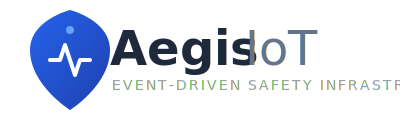

  

   
   

  
  
  
  

  <h3>Distributed Accident Response & Telemetry System</h3>

---

## 🦅 System Overview

**Aegis IoT** is a production-grade safety infrastructure designed to drastically reduce emergency response times for motorcycle accidents. 

Unlike traditional passive trackers, Aegis utilizes an **Event-Driven Architecture** to process real-time telemetry from on-vehicle sensors. It employs disjoint processing (Client vs. Cloud) to ensure that critical accident events are detected locally and verified centrally, eliminating false positives while guaranteeing sub-second alert dispatch.

### 🏆 Key Engineering Highlights for Resume
*   **Distributed Telemetry Processing**: Decoupled sensor ingestion (Firebase) from business logic (Node.js Worker), handling high-throughput location streams.
*   **Idempotent Alerting Pipeline**: Implemented race-condition guards to prevent duplicate SOS signals during sensor spikes.
*   **Hybrid Client Connectivity**: Client switches dynamically between standardized REST APIs (Auth) and Socket-based streams (Data) for optimal battery/network efficiency.

---

## 📂 System Modules

The repository is structured as a monorepo containing the two core pillars of the infrastructure. Please refer to the respective documentation for installation and setup guides.

| **📱 Mobile Client** | **☁️ Cloud Core** |
| :--- | :--- |
| **[View Documentation](./bike-mobile/README.md)** | **[View Documentation](./bike-backend/README.md)** |
| *React Native • Expo • Zustand* | *Node.js • Express • MySQL • Redis* |
| The rider-facing dashboard. Validates sensor data locally and visualizes real-time status. | The decision engine. Triangulates hospitals via Google Places and dispatches Twilio SMS. |

---

## 🏗️ High-Level Architecture

The system follows a reactive pattern where state changes in the Realtime Database trigger asynchronous worker processes.

---

## 📜 License
This project is open-source and available under the [MIT License](./LICENSE).