<div align="center">

  

  <br />
  <br />

  [](./)
  [](./LICENSE)
  [](./)
  [](https://github.com/ibesuperv/AegisToT)

  <h3>Distributed Accident Response & Telemetry System</h3>

</div>

---

## 🦅 System Overview

**Aegis IoT** is a production-grade safety infrastructure designed to drastically reduce emergency response times for motorcycle accidents. 

Unlike traditional passive trackers, Aegis utilizes an **Event-Driven Architecture** to process real-time telemetry from on-vehicle sensors. It employs disjoint processing (Client vs. Cloud) to ensure that critical accident events are detected locally and verified centrally, eliminating false positives while guaranteeing sub-second alert dispatch.

### 🏆 Key Engineering Highlights for Resume
*   **Distributed Telemetry Processing**: Decoupled sensor ingestion (IoT Hardware -> Firebase) from business logic (Node.js Worker), handling high-throughput location streams.
*   **Idempotent Alerting Pipeline**: Implemented race-condition guards to prevent duplicate SOS signals during sensor spikes.
*   **Hybrid Connectivity**: ESP32 microcontroller handles real-time sensor uploads, while the mobile app serves as a management and tracking dashboard.

---

## ❓ Why Aegis IoT?

### The "Golden Hour" Imperative
The **Golden Hour** refers to the critical 60-minute window following a traumatic injury where prompt medical treatment has the highest likelihood of preventing death.
*   **28x Higher Risk**: Motorcyclists are 28 times more likely to die in a crash than passenger car occupants (NHTSA).
*   **80% Injury Rate**: Unlike car accidents, nearly 80% of reported motorcycle crashes result in injury or death.
*   **The Silent Killer**: In solo-vehicle accidents—common on rural roads—an unconscious rider cannot call for help, leading to delayed discovery and preventable fatalities.

**Aegis IoT bridges this gap.** By automating the distress signal, we ensure emergency responders are alerted instantly, regardless of the rider's condition.

---

## 📂 System Modules

The repository is structured as a monorepo containing the two core pillars of the infrastructure. Please refer to the respective documentation for installation and setup guides.

<div align="center">

| **📱 Mobile Client** | **☁️ Cloud Core** | **HARDWARE** |
| :--- | :--- | :--- |
| **[View Documentation](./bike-mobile/README.md)** | **[View Documentation](./bike-backend/README.md)** | **IoT Node** |
| *React Native • Expo • Zustand* | *Node.js • Express • MySQL* | *ESP32 • Sensors* |
| The rider-facing dashboard. Validates sensor data locally and visualizes real-time status. | The decision engine. Triangulates hospitals via Google Places and dispatches Twilio SMS. | Captures IR, LDR, Tilt, and GPS data; uploads to Firebase. |

</div>

---

## 🏗️ High-Level Architecture

The system follows a reactive pattern where state changes in the Realtime Database trigger asynchronous worker processes.


### 🔄 End-to-End Data Flow

The following sequence diagram illustrates the lifecycle of a crash event, demonstrating the system's **< 200ms latency** from impact to alert.

```mermaid
sequenceDiagram
    participant S as IoT Sensors (ESP32)
    participant F as Firebase RTDB
    participant W as Node.js Worker
    participant G as Google Places API
    participant T as Twilio Gateway
    participant E as Emergency Contact

    Note over S: Impact Detected (Tilt > 45°)
    S->>F: PUT /user/accident = true
    F-->>W: Event Trigger (child_changed)
    
    activate W
    W->>W: Validate Idempotency Key
    W->>G: Query Nearest Hospital(lat, lng)
    G-->>W: Returns "City General, 1.2km"
    
    W->>T: Dispatch SMS (Location + Hospital)
    T-->>E: "CRASH DETECTED! Location: ..."
    deactivate W
    
    Note over E: SMS Received in < 3s
```




---

## 🧩 Hardware Components

The IoT node is built around an **ESP32** microcontroller, utilizing specific sensors to populate the Firebase fields shown below.

| Component | Sensor Module | Function | Firebase Key |
| :--- | :--- | :--- | :--- |
| **Main Controller** | **ESP32 WROOM** | Handles WiFi connectivity and sensor logic. | N/A |
| **Gyroscope/Accel** | **MPU-6050** | Measures inclination (`tiltAngle`) to detect falls/crashes. | `tiltAngle` |
| **GPS** | **NEO-6M** | diverse Returns real-time Latitude & Longitude. | `lat`, `lng` |
| **Proximity** | **IR Sensor** | Detects near-field objects (e.g., helmet wear check). | `ir` |
| **Light Sensor** | **LDR** | Measures ambient brightness to control headlights. | `ldr` |
| **Actuator** | **LED / Relay** | Simulates the bike's headlight subsystem. | `headlight` |
| **Safety** | **Blink Sensor** | Monitors rider drowsiness/eye closure. | `drowsy` |

---

## 📡 IoT Telemetry Data Structure

The **ESP32** module uploads real-time sensor data to the Firebase Realtime Database under a sanitized user email key.

```json
{
  "user": {
    "ramsita5725@example_com": {
      "accident": true,          // Triggered by Tilt > Threshold + Vibration
      "drowsy": false,           // Eye-blink sensor status
      "headlight": false,        // LDR-controlled Headlight Status
      "ir": 512,                 // Infrared Proximity Value (0-4095)
      "ldr": 600,                // Light Dependent Resistor Value
      "lat": "37.654321",        // GPS Latitude
      "lng": "-122.654321",      // GPS Longitude
      "tiltAngle": 15,           // Gyroscopic Tilt (Degrees)
      "phoneNumber": "+9199...", // Owner Phone
      "smsSent": true            // Ack flag for accident worker
    }
  }
}
```

---

## 🔮 Future Roadmap

We are constantly evolving to meet modern safety standards.
*   [ ] **Machine Learning Crash Analysis**: Implementing a Python microservice to analyze raw accelerometer data, reducing false positives from potholes/bumps.
*   [ ] **WatchOS / WearOS App**: Biometric integration to monitor rider heart rate post-crash.
*   [ ] **Offline-First Mode**: LoRaWAN integration for accident reporting in cellular dead zones.

---

## 🤝 Contributing

We welcome contributions! Please see our [CONTRIBUTING.md](./CONTRIBUTING.md) for details on how to submit pull requests, report issues, and suggest improvements.

## 🛡️ Security

For vulnerability reporting, please refer to our [SECURITY.md](./SECURITY.md).

---

## 📜 License
This project is open-source and available under the [MIT License](./LICENSE).