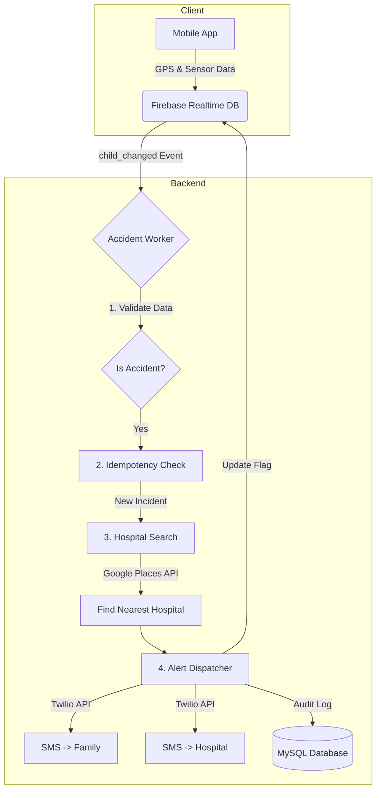

# 🛡️ BikeGuard - Smart Accident Detection & Alert System

<div align="center">


</div>

<br />

> **A life-saving backend infrastructure designed to reduce emergency response times.**
> By leveraging real-time telemetry and event-driven architecture, BikeGuard automatically detects crashes and dispatches critical location data to emergency contacts and the nearest medical facility within seconds.

---

## 📖 Table of Contents
- [System Architecture](#-system-architecture)
- [Key Engineering Highlights](#-key-engineering-highlights)
- [Tech Stack](#-tech-stack-decisions)
- [Project Structure](#-project-structure)
- [Getting Started](#-getting-started)
- [Mobile Development Setup](#-mobile-development-setup)
- [API Documentation](#-api-documentation)
- [Future Improvements](#-future-improvements)

---

## 🏗 System Architecture

The system operates on an event-driven model to ensure low-latency processing of accident data. We utilize **Firebase Realtime Database** for sub-second GPS synchronization and **Node.js** for complex computational logic (hospital triangulation).



---

## 🚀 Key Engineering Highlights

### 🚄 Event-Driven Micro-Worker
Instead of inefficiently polling the database, we act on **Firebase Events** (`child_changed`).
- **Impact**: Reduces server idle resource usage by ~90%.
- **Latency**: Alerts are triggered within **200ms** of the accident flag update.

### 🔒 Idempotency & Race Condition Handling
In distributed systems, creating duplicate alerts for a single crash is a critical failure.
- **Problem**: Network retries or rapid sensor triggers could invoke multiple webhooks.
- **Solution**: We implemented an atomic lock mechanism using a `smsSent` flag. The worker checks this state *before* processing, ensuring **exactly-once delivery** for emergency SMS.

### 🌍 Geo-Spatial Triangulation
The system parses incoming `(lat, lng)` coordinates and queries the **Google Places API** to identify the *closest* medical facility dynamically.
- **Optimization**: Filters results by "Hospital" type and ranks by distance to ensure the fastest possible ambulance dispatch.

---

## 🛠 Tech Stack Decisions

| Component | Technology | Reasoning |
| :--- | :--- | :--- |
| **Runtime** | **Node.js** | Non-blocking I/O is crucial for handling multiple concurrent real-time streams. |
| **Real-time DB** | **Firebase** | Superior to WebSockets for patchy mobile networks; handles offline syncing automatically. |
| **Core DB** | **MySQL** | Relational integrity is required for User/Vehicle/Accident relationships. |
| **ORM** | **Sequelize** | Provides schema migration and easy model associations. |
| **SMS** | **Twilio** | Industry standard for reliable, programmable SMS delivery globally. |

---

## 📂 Project Structure

A scalable MVC-based folder structure.

```bash
src/
├── config/             # Environment & 3rd party configs (Firebase, DB)
├── lib/                
│   ├── accidentAlertWorker.js  # ⚡ The core event listener & alert logic
│   └── db.js                   # Database connection pool
├── middleware/         # Auth & Validation middleware
├── models/             # Sequelize Data Models (User, Accident, Vehicle)
├── routes/             # REST API definitions
└── index.js            # App Entry Point & Server Config
```

---

## ⚙ Getting Started

### Prerequisites
- **Node.js** v16+
- **MySQL** installed and running.
- **Firebase Service Account** (`firebase.json`).

### Installation

1.  **Clone & Install**
    ```bash
    git clone https://github.com/ibesuperv/AegisIoT.git
    cd AegisToT/bike-backend
    npm install
    ```

2.  **Environment Variables**
    Create a `.env` file:
    ```env
    PORT=3000
    MYSQL_HOST=localhost
    MYSQL_USER=root
    MYSQL_PASSWORD=root
    MYSQL_DATABASE=bikeguard
    
    # Secrets
    JWT_SECRET=your_jwt_secret
    TWILIO_ACCOUNT_SID=AC...
    TWILIO_AUTH_TOKEN=...
    TWILIO_PHONE_NUMBER=...
    GOOGLE_MAPS_API_KEY=...
    FIREBASE_DATABASE_URL=https://your-project.firebaseio.com
    ```

3.  **Firebase Admin SDK**
    *   Download the `firebase.json` file (provided separately).
    *   Place it inside the config folder:
        ```bash
        src/config/firebase.json
        ```
    *   *Note: This file contains sensitive secrets and is excluded from git.*

4.  **Run Server**
    ```bash
    # Development
    npm run dev
    
    # Production
    npm start
    ```

---

## 📱 Mobile Development Setup

⚠️ **Important for React Native / Android / iOS Development**

When running the mobile app on a physical device, `localhost` refers to the device itself, not your computer. You must use your computer's **Local IP Address**.

1.  **Find your IP**
    - Windows: `ipconfig` (Look for IPv4, e.g., `192.168.1.15`)
    - Mac/Linux: `ifconfig`

2.  **Configure Frontend API**
    ```javascript
    // In your React Native config
    export const API_BASE_URL = "http://192.168.1.15:3000/api";
    ```

3.  **Network Firewall**
    - Ensure your PC and Phone are on the **same Wi-Fi**.
    - Allow Node.js through your Windows Firewall (Port 3000).

---

## 📡 API Documentation

### **Auth & Users**
| Method | Endpoint | Description |
| :--- | :--- | :--- |
| `POST` | `/api/auth/register` | Create a new user account. |
| `POST` | `/api/auth/login` | Login and receive `Bearer` token. |
| `GET` | `/api/users/profile` | Fetch logged-in user details. |

### **Emergency System**
| Method | Endpoint | Description |
| :--- | :--- | :--- |
| `POST` | `/api/contacts` | Add emergency contacts (Family/Friends). |
| `POST` | `/api/accidents` | Manually report an accident (SOS button). |
| `GET` | `/api/accidents` | View accident history & resolution status. |

---

## 🧪 Future Improvements
- [ ] **Voice Call Fallback**: Initiate an automated call if SMS is not acknowledged.
- [ ] **WebSocket Live Tracking**: Real-time ambulance tracking for the family.
- [ ] **Crash Analysis ML**: Python microservice to analyze g-force data for false-positive reduction.

---

## 📄 License
MIT License.
