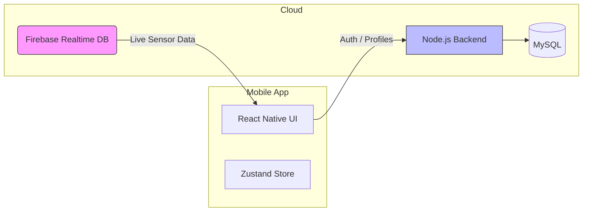

# 📱 BikeGuard Mobile - Live Accident Monitor

<div align="center">


</div>

<br />

> **The companion app for the BikeGuard system.**
> Monitors real-time sensor telemetry, displays live accident alerts, and manages user profiles and emergency contacts. Built with Expo Router for a seamless native experience.

---

## 📖 Table of Contents
- [Features](#-features)
- [Architecture](#-hybrid-architecture)
- [Screens](#-screens)
- [Tech Stack](#-tech-stack)
- [Getting Started](#-getting-started)
- [Configuration](#-configuration)
- [Project Structure](#-project-structure)

---

## ⚡ Features

-   **Dashboard**: Live status indicators for **Accident**, **Drowsiness**, and SOS alerts. Features a smooth pulse animation for critical states.
-   **Real-time Telemetry**: Direct connection to Firebase for sub-second updates on:
    -   📍 Live GPS Location
    -   📐 Bike Tilt Angle
    -   💡 Headlight Status
-   **Map Tracking**: Integrated Google Maps view to track the bike's current position.
-   **Emergency Management**: Add/Edit emergency contacts who receive SMS alerts.
-   **Fleet Management**: Register and manage multiple vehicles.

---

## 🏗 Hybrid Architecture

This app utilizes a unique **Dual-Connection** pattern to optimize for speed and reliability:

1.  **Auth & Management (REST API)**: Connects to the Node.js backend for secure operations like Login, Registration, and Profile updates.
2.  **Live Monitoring (Direct Firebase)**: Connects *directly* to Firebase Realtime Database for sensor data. This avoids backend bottlenecks and provides **zero-latency** updates.



---

## 📱 Screens

| Screen | Description |
| :--- | :--- |
| **Home (`index`)** | Main dashboard with pulse animations for alerts and sensor stats. |
| **Map (`map`)** | Full-screen map tracking the bike's coordinate stream. |
| **Alerts (`alert`)** | History of past accidents and notifications. |
| **Profile (`profile`)** | User settings and emergency contact management. |

---

## 🛠 Tech Stack

| Component | Technology | Reasoning |
| :--- | :--- | :--- |
| **Framework** | **Expo (React Native)** | Enables rapid cross-platform deployment with OTA updates. |
| **Routing** | **Expo Router** | File-system based routing for intuitive, web-like navigation structure. |
| **State** | **Zustand** | Minimalist 2KB boilerplate-free store; simpler than Redux for this scale. |
| **Maps** | **React Native Maps** | Native map rendering for high-performance coordinate tracking. |
| **Storage** | **AsyncStorage** | Persists user session and cached emergency contacts. |
| **Styling** | **StyleSheet** | Zero-runtime overhead compared to CSS-in-JS libraries. |

---

## ⚙ Getting Started

### Prerequisites
-   **Node.js** v16+
-   **Expo Go** app installed on your physical device (Android/iOS).
-   **Android Emulator** (Optional).

### Installation

1.  **Clone the Repo**
    ```bash
    git clone https://github.com/ibesuperv/AegisIoT.git
    cd AegisToT/bike-mobile
    ```

2.  **Install Dependencies**
    ```bash
    npm install
    ```

3.  **Start Expo Server**
    ```bash
    npx expo start
    ```
    Scan the QR code with your phone (using Expo Go) or press `a` to run on Android Emulator.

---

## 🔧 Configuration

### API Connection
**Crucial for Physical Devices:**
The app uses a smart configuration file (`constants/api.js`) to automatically switch between the Android Emulator loopback address and your physical device's network address.

**You MUST update the `physical device` IP address to match your computer's local IP.**

1.  Open `constants/api.js`.
2.  Find your local IP (Run `ipconfig` on Windows or `ifconfig` on Mac/Linux).
3.  Update the code:

    ```javascript
    import { Platform } from "react-native";
    import * as Device from "expo-device";

    const API_URL =
      Platform.OS === "android" && Device.isDevice === false
        ? "http://10.0.2.2:3000"        // Android Emulator
        : "http://192.168.1.15:3000";   // <--- REPLACE THIS with your IP (Expo Go / physical device)

    export default API_URL;
    ```
    *If you don't do this, the app will not reach the backend from your phone.*

### Firebase
The project requires a Firebase configuration file to connect to the backend services.

1.  **Download** the `firebase.js` file (provided separately).
2.  **Place it** inside the `constants/` folder:
    ```
    bike-mobile/constants/firebase.js
    ```

---

## 📂 Project Structure

```bash
app/
├── (auth)/         # Login / Signup Screens
├── (tabs)/         # Main App Tabs (Home, Map, Profile)
└── _layout.jsx     # Root Navigation & Auth Logic

components/         # Reusable UI Components (SafeScreen, Buttons)
constants/          # Config (Colors, API, Firebase)
store/              # Global State (Zustand)
assets/             # Images & Fonts
```

---

## 📄 License
MIT License.
